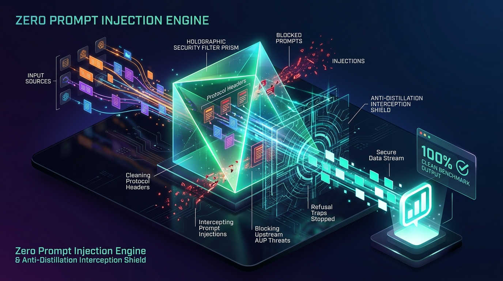
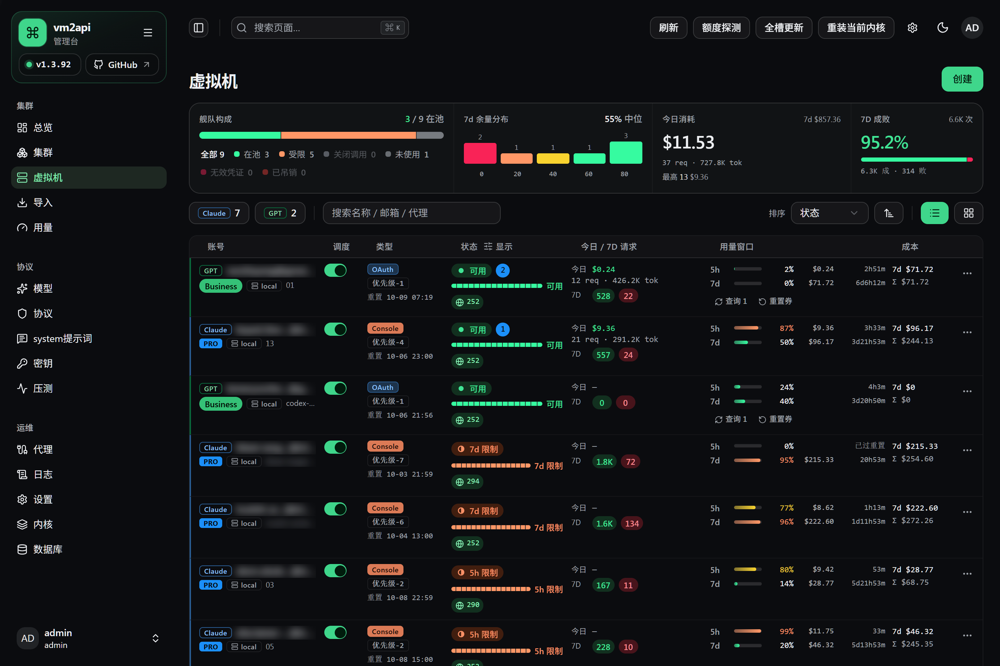
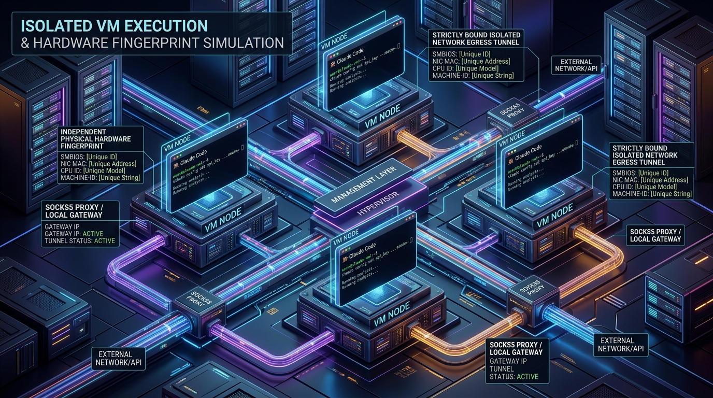
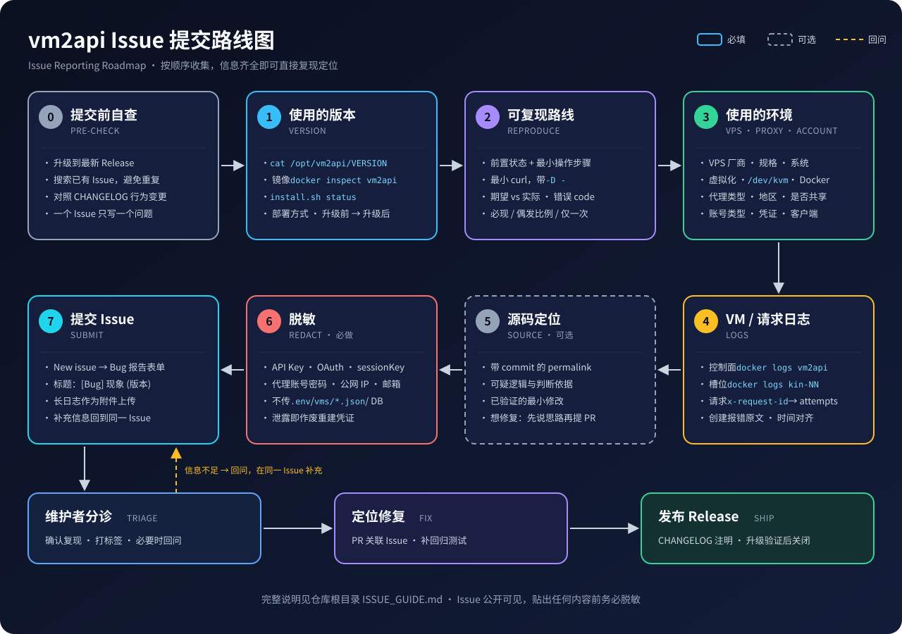

<div align="center">

# vm2api

### 完全隔离的虚拟机级 AI 订阅转 API 生产网关
**Next-Generation Fully Isolated VM-Level AI Subscription-to-API Gateway**

[](https://github.com/dofastted/vm2api/releases)
[](LICENSE)
[](docs/benchmarks/README.md)
[](docs/DEPLOY.md)

<p align="center">
  <a href="#-简体中文"><b>🇨🇳 简体中文</b></a> •
  <a href="#-english"><b>🇬🇧 English</b></a> •
  <a href="docs/技术路线.md"><b>🗺️ 技术路线</b></a> •
  <a href="docs/DEPLOY.md"><b>🚀 部署指南</b></a> •
  <a href="docs/benchmarks/README.md"><b>📊 干净度基准</b></a> •
  <a href="#-交流与赞助支持--community--sponsorship"><b>☕ 支持捐赠</b></a>
</p>

---


</div>

<br/>

> [!NOTE]
> **vm2api** 专为高可靠 AI 订阅转化为生产级标准 API 设计。摒弃传统的简单 HTTP 逆向与易被封禁的公用代理方案，采用**全隔离虚拟机/容器环境 + 官方真实客户端进程常驻 + 真实硬件指纹拟真 + 单槽单独立网络出口 + 智能前置蒸馏拦截**，实现真正稳定、长效、高并发的订阅转 API 基础设施。

---

# 🇨🇳 简体中文

## 目录
- [💡 项目概览](#-项目概览)
- [🛡️ 九大核心特性（特色防封与拟真矩阵）](#️-九大核心特性特色防封与拟真矩阵)
  - [0️⃣ 独家 0 提示词注入机制 & 改写引擎](#0️⃣-独家-0-提示词注入机制--改写引擎)
  - [1️⃣ 真实拟真物理机环境](#1️⃣-真实拟真物理机环境)
  - [2️⃣ 官方 Claude Code 真实进程转发](#2️⃣-官方-claude-code-真实进程转发)
  - [3️⃣ 智能前置拦截与“蒸馏拦截”](#3️⃣-智能前置拦截与蒸馏拦截)
  - [4️⃣ 完整的隔离网络环境（1 VM = 1 独立网络出口）](#4️⃣-完整的隔离网络环境1-vm--1-独立网络出口)
  - [5️⃣ 前置协议清洗与多协议统一结构化](#5️⃣-前置协议清洗与多协议统一结构化)
  - [6️⃣ 官方遥测（Telemetry）可控开关](#6️⃣-官方遥测telemetry可控开关)
  - [7️⃣ 分布式集群系统（多 VPS 跨机舰队管理）](#7️⃣-分布式集群系统多-vps-跨机舰队管理)
  - [8️⃣ 完整的企业级 API 密钥与配额管理](#8️⃣-完整的企业级-api-密钥与配额管理)
- [📊 干净度基准评测（Benchmarks）](#-干净度基准评测benchmarks)
- [🚀 快速开始（生产部署）](#-快速开始生产部署)
- [🔌 接口与协议兼容](#-接口与协议兼容)
- [💬 交流与赞助支持](#-交流与赞助支持--community--sponsorship)
- [📜 许可证与免责声明](#-许可证与免责声明--license)

---

## 💡 项目概览

在当今大模型服务中，直接使用第三方逆向脚本或共享代理极易触发风控导致封号、降权与服务中断。**vm2api** 是业界领先的虚拟机级 API 转换中继系统：

- **支持平台**：全面支持 **Anthropic (Claude Pro / Team / Enterprise / Max)** 以及 **OpenAI (ChatGPT / Codex)** 订阅转标准 API。
- **真实载体**：Anthropic 采用官方客户端在隔离 VM / 容器内运行**真实系统进程**，而非第三方伪造 HTTP 模拟。
- **全链路拟真**：从物理机硬件指纹（SMBIOS、MAC、Machine-ID）到独立 SOCKS5 / 本地网络出口，全方位还原真实开发者电脑环境。
- **极简集成**：向上游输出标准 OpenAI `/v1/chat/completions`、`/v1/responses` 与 Anthropic `/v1/messages` 兼容接口，任何支持标准 API 的前端、Agent 或应用均可无缝接入。

---

## 🛡️ 九大核心特性（特色防封与拟真矩阵）

<div align="center">
  
</div>

### 0️⃣ 独家 0 提示词注入机制 & 改写引擎
- **无感透传，告别 System 篡改**：传统中继依赖向 Prompt 注入大段系统人设与假装指令，不仅消耗高昂 Token，还极易引发模型“自我认知混乱”并被上游识别封号。vm2api 身份在凭证层即对齐官方形态，**做到真正 0 提示词注入（Zero Prompt Injection）**。
- **改写引擎与模板定制**：提供从 `zero`（完全零注入）、`official`、`official_full` 到自定义改写模板的灵活切换，满足特殊上下文场景需求。
- **提供公开 Benchmarks**：随仓库公开提供干净度测试套件与判定报告，杜绝官方内置工具及泄露痕迹，供所有人测试与对比检验。

### 1️⃣ 真实拟真物理机环境
- **消除云主机与多开痕迹**：不仅是普通 Docker 容器，更可支持真虚拟机（KVM / QEMU）。
- **全套物理硬件指纹拟真**：针对上游平台的设备探测，深度拟真真实物理机的硬件特征，涵盖独立 SMBIOS 信息、网卡 MAC 地址、CPU 拓扑、系统序列号、时区与真实的 `/etc/machine-id`。

### 2️⃣ 官方 Claude Code 真实进程转发 & 槽位管理
- **官方原版二进制常驻守护**：每一个 VM / 容器槽位内部均运行 Anthropic 原版 Claude Code 二进制程序，通过内核级 Unix Domain Socket 与协议路由总线通信，完全继承官方客户端签名与合规信誉，杜绝第三方逆向 HTTP 模拟带来的指纹泄露与封禁风险。
- **原生多路 Subagent 高并发调度**：单槽位原生支持多达 **20 路 Subagent 会话并发交互**。会话上下文在槽位内部原生隔离与状态持久化，享受官方客户端热缓存（Prompt Caching）加速与极致响应速度。
- **5h / 7d 官方用量窗口智能对齐**：控制面实时对齐 Anthropic 官方 5 小时滚动窗口与 7 天硬限消耗，精确计算重置倒计时（精确到分钟级）。支持设置水位报警阈值，额度逼近硬限时自动熔断并将流量平滑降级调度至空闲槽位。
- **全生命周期槽位状态机与健康监控**：实时追踪槽位调度状态（在池调度、5h/7d 冷却保护、调用关闭、凭证失效）。支持优先级分级路由（高优先级 VIP 槽位专属调度）、单槽独立成本流水统计与一键额度全槽健康探测。

<div align="center">
  
  <br/>
  <sub><i>线上生产环境实机运行脱敏截图：Claude / GPT 多槽位舰队状态、20 路并发承载、5h/7d 官方配额窗口追踪与实时成本流水</i></sub>
</div>

---

<div align="center">
  
</div>

### 3️⃣ 智能前置拦截与“蒸馏拦截”
- **反逆向与蒸馏提权拦截**：自动识别并拦截针对大模型的知识蒸馏（Model Distillation）、思维链逆向抓取（CoT Extraction）及恶意提示词攻击，不消耗官方额度。
- **上游 AUP / Refusal 智能阻断卫士**：
  - 实时捕获并分析官方请求与响应中的违规特征（Anthropic AUP 政策风险 / `stop_reason=refusal` / `content_filter`）。
  - 违规特征落库形成智能防护指纹，在网关入口处直接予以拦截，**彻底阻断违规请求触碰官方账号**，从根本上杜绝因敏感 Prompt 导致的账号封禁。

### 4️⃣ 完整的隔离网络环境（1 VM = 1 独立网络出口）
- **绝不共享 IP 资源**：系统严格要求**每一个 VM / KVM 槽位必须且只能绑定一条独立的网络出口**才能启动运行（支持专用独立 SOCKS5 代理、高匿出口池或独立本地出站网络）。
- **彻底告别关联连带封号**：账号之间绝对网络物理隔离，即便单条代理波动或单个账号受限，绝不殃及集群内的其它账号。
- **安全自定义 DoH 解析**：支持配置企业级自定义 HTTPS DoH（DNS-over-HTTPS）上游解析，全程代理加密传输，防止 DNS 劫持与 ISP 侧特征分析。

### 5️⃣ 前置协议清洗与多协议统一结构化
- **入站多协议通吃**：客户端可以使用 Anthropic 原生协议（`/v1/messages`）、OpenAI 标准格式（`/v1/chat/completions`）或新版 `/v1/responses` 格式发起请求。
- **深度清洗与官方对齐**：控制面在毫秒级内完成协议清洗与规范化，纠正非法角色、清理脏工具参数、补齐结构化要求，最终向 VM 内部官方进程交付符合官方客户端完全规范的纯净载荷。

---

<div align="center">
  
</div>

### 6️⃣ 官方遥测（Telemetry）可控开关
- **全量遥测模拟**：目标是让官方服务判定每一个槽位都是一台完全独立、在真实开发中活跃运行的电脑。
- **细粒度自主可控**：控制面提供全量遥测开关配置，可根据部署策略自主选择启用、隔离或特定遥测行为，既保留官方客户端信誉特征，又确保隐私边界。

### 7️⃣ 分布式集群系统（多 VPS 跨机舰队管理）
- **SSH 极简跨机纳管**：主控面通过原生 SSH 链接全球多台 VPS 节点，无需在远端节点繁琐部署复杂 Agent。
- **远程 Docker 统一编排**：直接跨机调度与管理各节点的容器与网络，槽位支持在集群节点自由放置与负载均衡。
- **内置安全 Web 终端**：基于 WebSocket + xterm 的一次性安全 Ticket 运维终端，直接在控制台一键直连管理远端槽位与 Docker 容器。

### 8️⃣ 完整的企业级 API 密钥与配额管理
- **多层级密钥体系**：拥有主控制 Master Key 以及针对团队或租户的多级 API Key，密钥入库采用 HMAC 索引与高强度加密。
- **官方配额窗口精确对齐**：对齐官方 5h / 7d 动态用量窗口与硬限保护，支持槽位独立配额覆盖，提供自动熔断、故障降级与空闲负载平衡。
- **实时审计与成本统计**：提供精确到 TTFT（首 Token 延迟）、真实 Prompt / Completion / 缓存命中 Token 的详尽流水与可视化图表分析。

---

## 📊 干净度基准评测（Benchmarks）

vm2api 严格遵循行业最严苛的**纯净度基准**。入站请求不泄露官方 CLI 身份、不外漏任何未授权的系统提示词与内部内置工具。

| 评测项 | 题目说明 | 判定 | 特性说明 |
|:---|:---|:---:|:---|
| **01 工具列表** | 探测是否泄露内置系统工具 | **100% 干净** | 未声明 tools 时，绝不返回 CLI 内部文件/执行工具 |
| **02 视觉识图** | 多模态图片解析能力与身份 | **100% 干净** | 原生多模态解析，无任何外挂包装痕迹 |
| **03 网页搜索** | 联网检索与外部工具调用 | **100% 干净** | 准确触发原生 `web_search` 并智能核算真实计费 |
| **04 自我认知** | 探测模型系统提示词与底层身份 | **100% 干净** | 表现为纯净 Claude 官方模型能力 |
| **05 角色扮演** | 复杂业务指令与预设遵从性 | **100% 干净** | 100% 服从用户设定的 System 与对话角色 |
| **06 提示词探取**| 针对底层系统 Prompt 的逆向刺探 | **安全防护** | 0 注入架构天然免疫敏感系统词泄露 |
| **07 强制工具** | 客户端指定 `tool_choice` 严格调度 | **100% 干净** | 完美执行客户端自定义函数定义与结构化输出 |

> 完整测试套件与详细数据归档请参阅：[docs/benchmarks/README.md](docs/benchmarks/README.md)。

---

## 🚀 快速开始（生产部署）

推荐在 **Ubuntu 24.04 LTS** 环境使用官方 Docker Compose 一键启动。

### 1. 一键脚本安装（推荐）

```bash
# 生产环境一键拉取并安装
curl -sSL https://raw.githubusercontent.com/dofastted/vm2api/main/deploy/install.sh | sudo bash

# 以后更新
curl -sSL https://raw.githubusercontent.com/dofastted/vm2api/main/deploy/install.sh | sudo bash -s -- upgrade
```

ARM64（aarch64）主机用同一条命令，脚本自动选择 `-arm64` 控制面镜像并准备 QEMU；实验性支持，见 [docs/ARM64.md](docs/ARM64.md)。

### 2. 手动 Docker Compose 启动

```bash
mkdir -p /opt/vm2api && cd /opt/vm2api
curl -sSLO https://raw.githubusercontent.com/dofastted/vm2api/main/docker-compose.yml
curl -sSL -o .env https://raw.githubusercontent.com/dofastted/vm2api/main/.env.example
chmod 600 .env

# 按需修改 .env 中的关键变量（VM2API_API_KEY, VM2API_ADMIN_PASSWORD, VM2API_DB_SECRET）
docker compose pull && docker compose up -d
```

### 3. 访问与调用

服务启动后，系统暴露统一服务端口（默认 `8787`）：

- **可视化管理面板**：`http://<您的IP>:8787/console`（默认账号：`admin` / 密码：`123456` 或自定义环境变量）
- **服务健康探活**：`GET http://<您的IP>:8787/health`
- **Anthropic 协议调用**：`POST http://<您的IP>:8787/v1/messages`
- **OpenAI 兼容协议**：`POST http://<您的IP>:8787/v1/chat/completions`

```bash
# 调用示例（以 Anthropic 原生接口为例）
curl -sS http://127.0.0.1:8787/v1/messages \
  -H "Authorization: Bearer $VM2API_API_KEY" \
  -H "content-type: application/json" \
  -d '{
    "model": "claude-sonnet-5-5",
    "max_tokens": 128000,
    "messages": [{"role": "user", "content": "Hello!"}]
  }'
```

---

## 🔌 接口与协议兼容

vm2api 内置全栈自适应网关，原生支持以下所有主流生态：

| 协议入口 | 对应标准 | 兼容客户端与场景 |
|:---|:---|:---|
| `/v1/messages` | Anthropic Messages API | Claude 官方 SDK、Cursor、Continue、LibreChat、Roo Code |
| `/v1/chat/completions` | OpenAI Chat API | NextChat、Open WebUI、Lobechat、LangChain、AutoGPT |
| `/v1/responses` | OpenAI Responses API | 新一代结构化智能体与高级编码工具生态 |
| `/v1/models` | 标准模型列表 API | 自动同步当前槽位支持的所有模型矩阵 |

---

<br/>

# 🇬🇧 English

## Table of Contents
- [💡 Overview](#-overview)
- [🛡️ 9 Core Pillars (Anti-Ban & Emulation Matrix)](#️-9-core-pillars-anti-ban--emulation-matrix)
  - [0️⃣ Zero Prompt Injection Engine](#0️⃣-zero-prompt-injection-engine)
  - [1️⃣ Physical Hardware Fingerprint Emulation](#1️⃣-physical-hardware-fingerprint-emulation)
  - [2️⃣ Official Claude Code Native Process Forwarding](#2️⃣-official-claude-code-native-process-forwarding)
  - [3️⃣ Pre-Interception & "Anti-Distillation" Shield](#3️⃣-pre-interception--anti-distillation-shield)
  - [4️⃣ Completely Isolated Network (1 VM = 1 Egress)](#4️⃣-completely-isolated-network-1-vm--1-egress)
  - [5️⃣ Deep Protocol Cleansing & Multi-Inbound Structuring](#5️⃣-deep-protocol-cleansing--multi-inbound-structuring)
  - [6️⃣ Configurable Official Telemetry](#6️⃣-configurable-official-telemetry)
  - [7️⃣ Multi-VPS Cluster Management](#7️⃣-multi-vps-cluster-management)
  - [8️⃣ Enterprise API Key & Quota Management](#8️⃣-enterprise-api-key--quota-management)
- [📊 Cleanliness Benchmarks](#-cleanliness-benchmarks)
- [🚀 Quick Start (Production Setup)](#-quick-start-production-setup)
- [💬 Community & Sponsorship](#-交流与赞助支持--community--sponsorship)
- [📜 License & Compliance](#-许可证与免责声明--license)

---

## 💡 Overview

Traditional methods of converting AI subscriptions into API endpoints via simple reverse proxies frequently result in immediate account suspensions, stealth downgrades, and token corruption. **vm2api** is an enterprise-grade virtual machine gateway designed for ultra-reliable subscription-to-API infrastructure:

- **Universal Support**: Seamlessly converts **Anthropic (Claude Pro / Team / Enterprise / Max)** and **OpenAI (ChatGPT / Codex)** subscriptions into robust standard APIs.
- **Genuine Client Process**: Runs the **authentic official Claude Code CLI system process** inside an isolated VM / container instance instead of fragile HTTP emulation.
- **High-Fidelity Emulation**: From physical SMBIOS, NIC MAC, and Machine-ID to dedicated per-slot network egress and smart upstream AUP guards.
- **Standard Compatibility**: Provides drop-in replacements for Anthropic `/v1/messages` and OpenAI `/v1/chat/completions` / `/v1/responses`.

---

## 🛡️ 9 Core Pillars (Anti-Ban & Emulation Matrix)

### 0️⃣ Zero Prompt Injection Engine
- **No System Prompt Tampering**: Unlike ordinary proxies that tamper with the system prompt and poison model identity, vm2api aligns credentials at the protocol layer as a genuine Console client.
- **Customizable Layouts**: Switch effortlessly between `zero` (pure zero-injection), `official`, `official_full`, and tailored templates.
- **Transparent Benchmarks**: Built-in benchmark suite guarantees no leaking of internal CLI tools or hidden instructions.

### 1️⃣ Physical Hardware Fingerprint Emulation
- **Eradicate Virtual Machine Artifacts**: Supports containerized slots as well as genuine KVM/QEMU hypervisor nodes.
- **Comprehensive Hardware Spoofing**: Simulates realistic hardware traits including SMBIOS identifiers, NIC MAC addresses, CPU architectures, system serials, and distinct `/etc/machine-id`.

### 2️⃣ Official Claude Code Native Process Forwarding & Slot Management
- **Authentic Official Binary Daemon**: Every VM / container slot runs the authentic, official Claude Code binary daemon inside an isolated hypervisor sandbox. Requests are relayed via kernel-level Unix Domain Sockets, completely eliminating heuristic fingerprint leakage caused by custom reverse proxies.
- **Native 20-Subagent Concurrency per Slot**: Each slot natively orchestrates up to **20 concurrent subagent threads** with isolated conversation states and official prompt caching reuse.
- **5h / 7d Upstream Quota Alignment**: Automatically aligns with Anthropic's rolling 5-hour and 7-day budget windows, calculating reset deadlines down to the minute. Integrates dynamic circuit breakers to gracefully divert traffic when a slot approaches its capacity limit.
- **Full Slot Lifecycle & Health Observability**: Visual real-time tracking of slot states (In-Pool, Cooldown Guard, Suspended, Token Expired), multi-tier priority routing, and real-time per-slot financial cost accounting.

<div align="center">
  
  <br/>
  <sub><i>Production live dashboard: Multi-slot fleet status, 20-concurrency subagent scheduling, 5h/7d quota window telemetry, and cost accounting (sanitized).</i></sub>
</div>

### 3️⃣ Pre-Interception & "Anti-Distillation" Shield
- **Reverse-Extraction & Distillation Prevention**: Automatically drops requests attempting model distillation or Chain-of-Thought scraping before upstream credits are consumed.
- **Upstream AUP & Refusal Guard**: Real-time detection and caching of upstream AUP violations and `stop_reason=refusal` patterns. Dangerous prompts are quarantined and blocked at the gateway entry, safeguarding accounts from termination.

### 4️⃣ Completely Isolated Network (1 VM = 1 Egress)
- **Zero Cross-Account Contamination**: Every VM slot is strictly bound to its own dedicated SOCKS5 proxy or local egress gateway. 
- **No Shared Egress**: Prevents cascade bans caused by multiple accounts sharing the same outbound IP.
- **Custom HTTPS DoH**: Supports custom DNS-over-HTTPS resolvers for stealthy and encrypted queries.

### 5️⃣ Deep Protocol Cleansing & Multi-Inbound Structuring
- **Multi-Protocol Inbound**: Connect with Anthropic Messages API, OpenAI Chat format, or modern Responses API.
- **Structural Rectification**: Normalizes invalid role sequences, corrects schema parameters, and translates inputs into clean payloads conforming to official client specifications.

### 6️⃣ Configurable Official Telemetry
- **Single-Machine Telemetry**: Accurately simulates the telemetry signatures of a standalone physical workstation.
- **Granular Control**: Operators can toggle and adjust telemetry forwarding based on operational privacy policies.

### 7️⃣ Multi-VPS Cluster Management
- **Agentless SSH Node Fleet**: Connect and orchestrate multiple remote VPS hosts through lightweight, secure SSH connections.
- **Remote Docker Bridge**: Effortlessly deploy, monitor, and place slot containers across different physical machines with built-in interactive web terminals (xterm).

### 8️⃣ Enterprise API Key & Quota Management
- **Multi-Tenant Security**: Master key architecture with secondary HMAC-indexed tenant tokens.
- **Official Quota Alignment**: Accurately tracks 5h/7d rolling budget windows, enforces rate limits (RPM/TPM), and provides seamless failover.
- **Comprehensive Telemetry & Observability**: Real-time tracking of TTFT, genuine token consumption, SLA, and failure classifications.

---

## 📊 Cleanliness Benchmarks

| Test Item | Description | Evaluation | Core Result |
|:---|:---|:---:|:---|
| **01 Tools List** | Inspects CLI internal tools leakage | **100% Clean** | Zero internal execution tools disclosed |
| **02 Vision** | Multimodal image understanding | **100% Clean** | Pure model vision without extra wrappers |
| **03 Web Search** | Live internet search queries | **100% Clean** | Native Anthropic `web_search` triggered accurately |
| **04 Identity** | Persona & identity probe | **100% Clean** | Clean Claude model identity preserved |
| **05 Roleplay** | Custom system instructions | **100% Clean** | 100% adherence to caller system definitions |
| **06 Prompt Leak** | Probing underlying system prompts | **Protected** | Zero prompt injection protects core assets |
| **07 Forced Tools** | Strict function calling with `tool_choice` | **100% Clean** | Accurate schema formatting and execution |

---

## 🚀 Quick Start (Production Setup)

```bash
# Recommended one-line installation on Ubuntu 24.04 LTS
curl -sSL https://raw.githubusercontent.com/dofastted/vm2api/main/deploy/install.sh | sudo bash
```

After deployment, access:
- **Management Console**: `http://<YOUR_IP>:8787/console`
- **Health Check**: `http://<YOUR_IP>:8787/health`
- **API Endpoint**: `POST http://<YOUR_IP>:8787/v1/messages`

---

## 🐞 问题反馈 / Issue Reporting

提交 Issue 前请阅读 [ISSUE_GUIDE.md](ISSUE_GUIDE.md)，按“版本 → 复现路线 → 环境（VPS / 代理）→ VM 与请求日志 → 源码定位（可选）→ 脱敏”收集信息，再用 [Bug 报告表单](https://github.com/dofastted/vm2api/issues/new/choose) 提交。

Before opening an issue, follow [ISSUE_GUIDE.md](ISSUE_GUIDE.md): version, reproduction steps, host/proxy environment, VM and request logs, optional source pointers — and redact all secrets.

<p align="center">
  
</p>

---

## 💬 交流与赞助支持 / Community & Sponsorship

开源与持续维护离不开社区大家的支持与反馈。如果您觉得 **vm2api** 为您的业务或学习带来了实质帮助， 交流群或请作者喝杯咖啡！

<div align="center">
  <table style="border-collapse: separate; border-spacing: 20px; background: transparent;">
    <tr>
      <td align="center" width="320" style="padding: 24px; border-radius: 16px; border: 1px solid rgba(255,255,255,0.1); background: rgba(255,255,255,0.03); backdrop-filter: blur(10px); box-shadow: 0 8px 24px rgba(0,0,0,0.25);">
        
        <br/><br/>
        <b style="font-size: 16px;">☕ 支持与赞助项目</b>
        <br/>
        <span style="color: #888; font-size: 13px;">请作者喝杯咖啡 · 助力持续迭代演进</span>
        <br/><br/>
        <a href="#-交流与赞助支持--community--sponsorship">
          
        </a>
      </td>
    </tr>
  </table>
  <p style="color: #777; font-size: 12px; margin-top: 10px;">特别鸣谢 <b>LINUX DO</b> 等开源技术社区同仁的支持与建议</p>
</div>

---

## 📈 Star History

[](https://star-history.com/#dofastted/vm2api&Date)

---

## 📜 许可证与免责声明 / License

- **个人与非商用**：本仓库遵循 [Noncommercial License](LICENSE)，仅供个人学习、技术研究与个人自建使用。
- **商业使用授权**：任何将本项目用于商业运营（包括对外付费 API、作为转售云服务基础组件、公司内部营利用途等）**必须事先取得作者正式书面授权**。授权联系请洽 [Telegram @VM2API](https://t.me/VM2API)。
- **免责声明**：vm2api 为独立的开源实验项目，与 Anthropic PBC 或 OpenAI 无任何直接关联。相关商标权属均归其对应公司所有。
